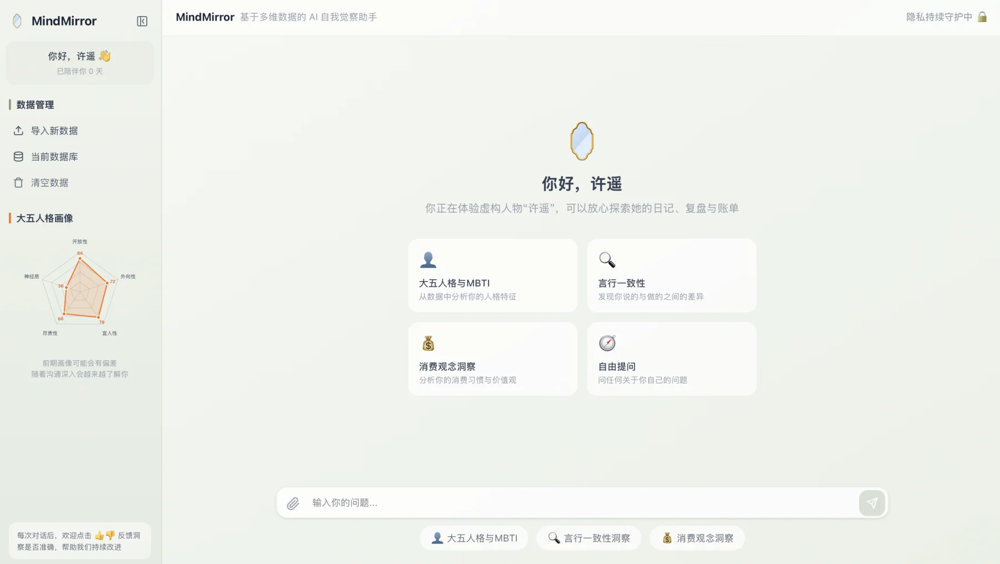
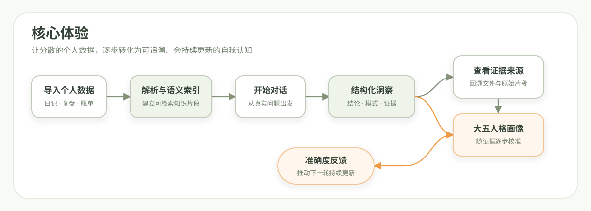
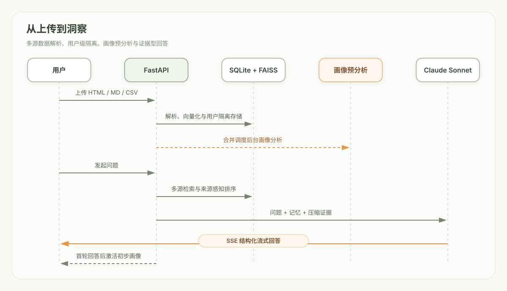

# MindMirror 🪞

### 基于多源个人数据的 AI 自我洞察助手

将分散在日常记录、阶段复盘和消费账单中的数字足迹，转化为**可追溯、会持续更新的自我认知**。

[在线体验](https://mindmirror.chat) · [产品 PRD](https://icnmqhcc34ly.feishu.cn/wiki/ENsuwN0p3iKvf9k7AHqcoRi5nOb) · [系统架构](#系统架构)

 

虚构示例人物“许遥”的产品主界面

---

## 为什么做 MindMirror

Hi，我是 Marcus。长期以来，我习惯用不同工具记录生活：灵感散落在 Flomo，复盘沉淀在 Markdown 文档，消费行为则留在记账软件里。这些数字足迹共同描述了一个人，却长期处于彼此割裂的状态。

当我回看这些跨平台数据时，产生了一个问题：**如果 AI 不只听我如何描述自己，而是同时观察我记录了什么、如何复盘，以及把钱花在了哪里，它是否能提供更接近真实行为的第三方视角？**

MindMirror 由此开始。它试图解决的不是“再做一个聊天机器人”，而是如何把多源数据、证据链、长期记忆和可解释的人格画像组合成一套完整的自我觉察体验。项目从 PRD、交互原型、RAG 与记忆设计开始，经过多轮线上使用和部署迭代，逐步形成了当前版本。

完整的需求背景、用户流程和产品取舍见 [MindMirror 产品需求文档](https://icnmqhcc34ly.feishu.cn/wiki/ENsuwN0p3iKvf9k7AHqcoRi5nOb)。

## 产品概览

MindMirror 是一个已经部署运行的产品化原型。它不把 AI 定位成只负责回应问题的聊天机器人，而是一个能够连接不同数据来源、引用具体证据并积累长期认知的观察者。

用户可以导入自己的日常记录、阶段复盘和消费账单。系统会在服务端完成解析、语义索引和跨来源检索，并在对话中将结论对应到具体文件、时间范围与原始片段。随着数据和对话增加，MindMirror 会持续更新滚动摘要与大五人格画像。

| 用户问题 | 常规 AI 助手的局限 | MindMirror 的产品切入 |
|---|---|---|
| 记录分散在多个平台 | 只能看到当前对话或单一文件 | 融合日记、复盘与账单，交叉验证不同维度 |
| 结论缺少依据 | 容易输出泛化、迎合式判断 | 每次洞察均可回溯到数据来源和证据片段 |
| 对话无法形成长期认知 | 多轮使用仍需反复解释背景 | 三层记忆与渐进画像，让系统持续积累理解 |

### 核心体验

## 核心产品能力

### 1. 多源个人数据融合

MindMirror 当前支持三类具有互补价值的数据：

| 数据类型 | 导入格式 | 主要信号 |
|---|---|---|
| 日常记录 | Flomo 导出 `.html` | 即时想法、情绪变化、日常选择 |
| 阶段复盘 | Markdown `.md` | 自我认知、目标规划、阶段反思 |
| 消费账单 | 账单 `.csv` | 真实支出、行为偏好、价值排序 |

文件会被解析为带来源、时间和类型信息的知识片段。针对财务、复盘和日常行为等不同问题，检索层会对相关来源进行差异化排序，而不是简单地把所有文本一次性发送给模型。

### 2. 可追溯的证据型洞察

回答采用稳定的三段式结构：

- **核心洞察**：直接回答用户真正需要关注的问题；
- **模式识别**：识别跨时间、跨来源重复出现的行为模式；
- **证据归因**：展示支撑结论的文件、时间范围和原始片段。

用户可以展开查看引用来源，并通过 👍 / 👎 反馈洞察是否准确。反馈会按照应用版本、数据来源和用户维度进入受保护的分析看板，形成产品迭代闭环。

### 3. 渐进式长期记忆

| 记忆层级 | 更新方式 | 产品作用 |
|---|---|---|
| 短期记忆 | 保留最近 3 轮对话 | 维持当前上下文和表达连贯性 |
| 滚动摘要 | 首轮生成，之后按阶段更新 | 延续跨主题信息，压缩长对话历史 |
| 长期画像 | 上传后预分析，并随早期对话快速迭代 | 沉淀稳定事实、价值观、目标、模式与风险 |

这套结构让系统既能快速响应当前问题，又不会因为对话变长而丢失长期背景。

### 4. 大五人格画像

- 上传完成后，系统在后台预计算初步画像；
- 多个连续上传会通过 30 秒防抖合并分析，避免重复模型调用；
- 初步结果在后台保持隐藏，首轮完整回答后立即显示；
- 前 5 轮对话持续更新，之后进入较稳定的阶段性更新；
- 初始画像保留明显的维度差异，避免所有分数集中在 50 附近；
- 单轮变化限制在 2–6 分，让变化可感知但不过度跳动。

大五人格用于呈现基于当前数据样本的阶段性倾向，不构成心理诊断。MBTI 仅作为辅助对话语言，不与大五人格直接换算。

### 5. 可直接体验的虚构示例

不希望上传私人数据的用户，可以直接进入“许遥”示例：

- 日常记录、半年复盘与账单均为虚构内容；
- 示例会话使用独立用户空间，不接触其他用户数据；
- 进入后立即展示预设大五人格画像；
- 当实时模型不可用时，自动展示基于同一虚构数据审核过的兜底回答。

这使首次体验不依赖用户准备文件，也避免演示过程中因模型波动失去完整产品闭环。

## 系统架构

### 从上传到洞察

## 快速体验

[打开 MindMirror 在线体验](https://mindmirror.chat)。

首次体验建议选择“直接体验虚构示例人物”：

1. 进入许遥的独立示例空间；
2. 查看已经准备好的日常记录、复盘和账单；
3. 从人格画像、言行一致性或消费观念开始提问；
4. 展开证据卡片检查结论来源；
5. 使用 👍 / 👎 提交准确度反馈。

## 技术实现与选型

MindMirror 的技术选择围绕三个目标展开：让对话体验足够流畅、让洞察能够追溯依据，并让个人项目在有限成本下长期稳定运行。前端使用 Next.js，主要看重其成熟的组件化能力和对复杂交互状态的支持，能够把对话、数据管理、证据展开和人格画像组织在同一个连贯界面中。后端采用 FastAPI，便于承载文件解析、检索编排和流式回答，也让不同洞察能力可以持续独立迭代。

在数据层，MindMirror 没有为了“技术复杂度”引入重量级基础设施，而是选择 SQLite 与 FAISS 的组合：前者负责结构化数据、用户隔离和长期记忆，后者负责个人知识片段的语义检索。这套方案与当前产品规模相匹配，部署简单、成本可控，也能保留未来迁移到更大规模数据服务的空间。

模型并不直接接收全部个人数据，而是基于问题检索相关证据，再结合短期上下文、滚动摘要和长期画像组织回答。生产环境通过容器化方式统一前后端和反向代理，并在每次发布前完成构建、测试与健康检查。这里的重点不是堆叠技术名词，而是让每一项技术选择都服务于产品体验、证据可信度和演示稳定性。

---

**用数据理解自己，也用证据校准认知。**

Designed and built by Marcus · Deployed on Tencent Cloud

