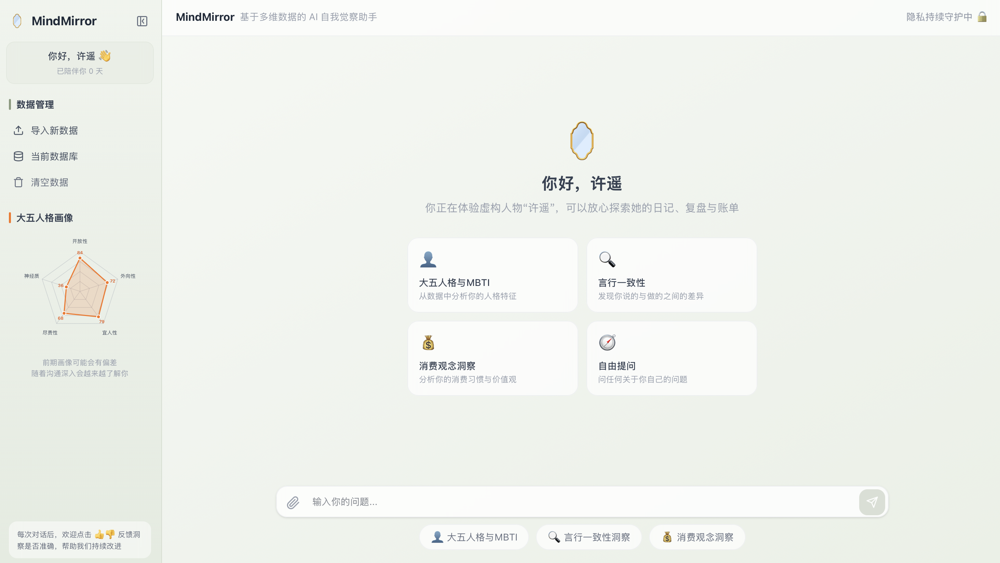
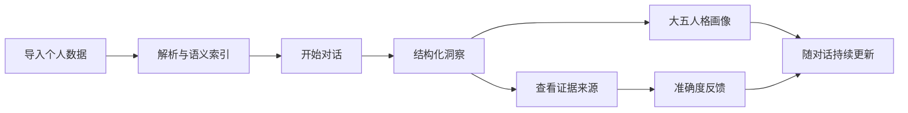
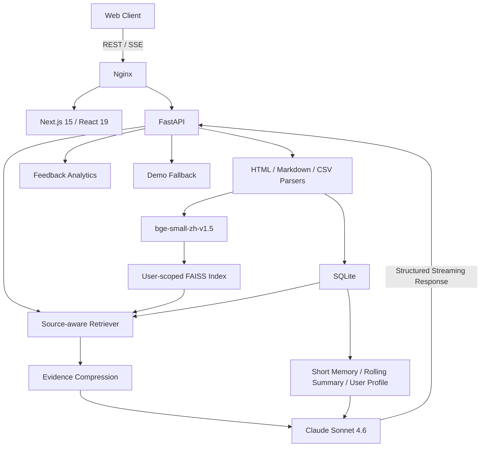
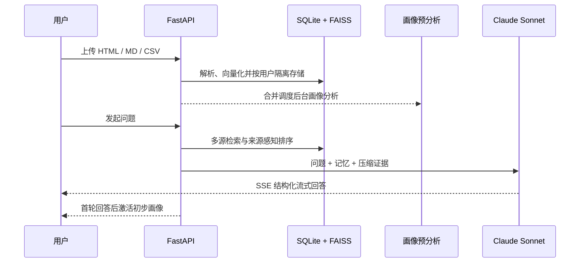
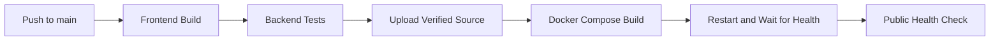

<div align="center">

# MindMirror 🪞

### 基于多源个人数据的 AI 自我洞察助手

将分散在日常记录、阶段复盘和消费账单中的数字足迹，转化为**可追溯、会持续更新的自我认知**。

[](https://github.com/HaeMarcus/MindMirror/actions/workflows/deploy.yml)


[](LICENSE)

[在线体验（见仓库 About）](#快速体验) · [产品 PRD](https://icnmqhcc34ly.feishu.cn/wiki/ENsuwN0p3iKvf9k7AHqcoRi5nOb) · [系统架构](#系统架构) · [部署说明](DEPLOYMENT.md)

<br />



<sub>虚构示例人物“许遥”的产品主界面</sub>

</div>

---

## 产品概览

MindMirror 是一个已经部署运行的产品化原型。它不把 AI 定位成只负责回应问题的聊天机器人，而是一个能够连接不同数据来源、引用具体证据并积累长期认知的观察者。

用户可以导入自己的日常记录、阶段复盘和消费账单。系统会在服务端完成解析、语义索引和跨来源检索，并在对话中将结论对应到具体文件、时间范围与原始片段。随着数据和对话增加，MindMirror 会持续更新滚动摘要与大五人格画像。

| 用户问题 | 常规 AI 助手的局限 | MindMirror 的产品切入 |
|---|---|---|
| 记录分散在多个平台 | 只能看到当前对话或单一文件 | 融合日记、复盘与账单，交叉验证不同维度 |
| 结论缺少依据 | 容易输出泛化、迎合式判断 | 每次洞察均可回溯到数据来源和证据片段 |
| 对话无法形成长期认知 | 多轮使用仍需反复解释背景 | 三层记忆与渐进画像，让系统持续积累理解 |

### 核心体验



## 为什么做 MindMirror

Hi，我是 Marcus。长期以来，我习惯用不同工具记录生活：灵感散落在 Flomo，复盘沉淀在 Markdown 文档，消费行为则留在记账软件里。这些数字足迹共同描述了一个人，却长期处于彼此割裂的状态。

当我回看这些跨平台数据时，产生了一个问题：**如果 AI 不只听我如何描述自己，而是同时观察我记录了什么、如何复盘，以及把钱花在了哪里，它是否能提供更接近真实行为的第三方视角？**

MindMirror 由此开始。它试图解决的不是“再做一个聊天机器人”，而是如何把多源数据、证据链、长期记忆和可解释的人格画像组合成一套完整的自我觉察体验。项目从 PRD、交互原型、RAG 与记忆设计开始，经过多轮线上使用和部署迭代，逐步形成了当前版本。

完整的需求背景、用户流程和产品取舍见 [MindMirror 产品需求文档](https://icnmqhcc34ly.feishu.cn/wiki/ENsuwN0p3iKvf9k7AHqcoRi5nOb)。

## 核心产品能力

### 1. 多源个人数据融合

MindMirror 当前支持三类具有互补价值的数据：

| 数据类型 | 导入格式 | 主要信号 |
|---|---|---|
| 日常记录 | Flomo 导出 `.html` | 即时想法、情绪变化、日常选择 |
| 阶段复盘 | Markdown `.md` | 自我认知、目标规划、阶段反思 |
| 消费账单 | 账单 `.csv` | 真实支出、行为偏好、价值排序 |

文件会被解析为带来源、时间和类型信息的知识片段。针对财务、复盘和日常行为等不同问题，检索层会对相关来源进行差异化排序，而不是简单地把所有文本一次性发送给模型。

### 2. 可追溯的证据型洞察

回答采用稳定的三段式结构：

- **核心洞察**：直接回答用户真正需要关注的问题；
- **模式识别**：识别跨时间、跨来源重复出现的行为模式；
- **证据归因**：展示支撑结论的文件、时间范围和原始片段。

用户可以展开查看引用来源，并通过 👍 / 👎 反馈洞察是否准确。反馈会按照应用版本、数据来源和用户维度进入受保护的分析看板，形成产品迭代闭环。

### 3. 渐进式长期记忆

| 记忆层级 | 更新方式 | 产品作用 |
|---|---|---|
| 短期记忆 | 保留最近 3 轮对话 | 维持当前上下文和表达连贯性 |
| 滚动摘要 | 首轮生成，之后按阶段更新 | 延续跨主题信息，压缩长对话历史 |
| 长期画像 | 上传后预分析，并随早期对话快速迭代 | 沉淀稳定事实、价值观、目标、模式与风险 |

这套结构让系统既能快速响应当前问题，又不会因为对话变长而丢失长期背景。

### 4. 大五人格画像

- 上传完成后，系统在后台预计算初步画像；
- 多个连续上传会通过 30 秒防抖合并分析，避免重复模型调用；
- 初步结果在后台保持隐藏，首轮完整回答后立即显示；
- 前 5 轮对话持续更新，之后进入较稳定的阶段性更新；
- 初始画像保留明显的维度差异，避免所有分数集中在 50 附近；
- 单轮变化限制在 2–6 分，让变化可感知但不过度跳动。

大五人格用于呈现基于当前数据样本的阶段性倾向，不构成心理诊断。MBTI 仅作为辅助对话语言，不与大五人格直接换算。

### 5. 可直接体验的虚构示例

不希望上传私人数据的用户，可以直接进入“许遥”示例：

- 日常记录、半年复盘与账单均为虚构内容；
- 示例会话使用独立用户空间，不接触其他用户数据；
- 进入后立即展示预设大五人格画像；
- 当实时模型不可用时，自动展示基于同一虚构数据审核过的兜底回答。

这使首次体验不依赖用户准备文件，也避免演示过程中因模型波动失去完整产品闭环。

## 信任、隐私与产品边界

MindMirror 处理的是高度个人化的数据，因此 README 不使用“数据绝不离开本机”这类模糊承诺，而是明确说明当前边界：

- 文件解析、Embedding、SQLite 存储和 FAISS 向量索引在 MindMirror 服务端完成；
- 每个用户拥有独立的数据命名空间和 FAISS 索引，文档、消息和记忆按用户隔离；
- 对话时仅将检索出的相关证据、必要记忆与当前问题发送给配置的大模型服务；
- 用户可以主动清除当前账号的文件、对话、记忆、反馈关联和向量索引；
- 开发者分析接口由管理员令牌保护，未配置令牌时默认不可访问；
- 示例数据完全虚构，不使用个人真实数据作为公开演示内容；
- 大五人格与 MBTI 属于自我反思工具，不替代专业心理测量或诊断。

## 系统架构



### 从上传到洞察



### 技术选型与权衡

| 领域 | 选择 | 取舍考量 |
|---|---|---|
| 前端 | Next.js 15 + React 19 + Tailwind CSS 4 | App Router、流式交互和轻量组件化能力 |
| API | FastAPI | 异步接口、类型约束和 SSE 支持清晰 |
| Embedding | bge-small-zh-v1.5（服务端本地） | 中文语义效果与部署成本平衡，避免额外 Embedding API 依赖 |
| 向量检索 | FAISS IndexFlatIP | 当前数据规模下采用精确搜索，架构简单且可控 |
| 业务存储 | SQLite | 单机部署零运维，并通过用户字段实现数据隔离 |
| 检索策略 | 向量检索 + 来源感知排序 | 针对财务、复盘、日常记录等问题提升对应来源权重 |
| 模型 | Claude Sonnet 4.6 | 长文本理解、结构化表达与证据综合能力 |
| 流式协议 | SSE | 单向生成场景更轻量，适合反向代理和浏览器原生消费 |

## 工程化与线上运行

MindMirror 当前生产环境运行在腾讯云轻量应用服务器，而不是只停留在本地演示。

| 能力 | 当前实现 |
|---|---|
| 容器化 | Frontend、Backend、Nginx 通过 Docker Compose 编排 |
| 自动发布 | `main` 更新后由 GitHub Actions 自动部署 |
| 发布门禁 | 前端生产构建、后端语法检查和单元测试通过后才进入部署 |
| 服务器更新 | Actions 上传已验证源码，避免中国大陆服务器直接拉取 GitHub 的网络波动 |
| 健康检查 | Docker 容器健康状态 + 公网 `/api/health` 双重检查 |
| 数据持久化 | SQLite 与用户向量索引存放在独立 Docker Volume |
| 可观测反馈 | 准确度、版本、来源与用户维度的受保护反馈看板 |
| 异常体验 | 明确的超时/重试提示；示例模式具备审核过的回答兜底 |

部署流程：



完整的服务器准备、GitHub Secrets 和发布说明见 [DEPLOYMENT.md](DEPLOYMENT.md)。

## 快速体验

线上地址维护在仓库右侧 **About** 区域。

首次体验建议选择“直接体验虚构示例人物”：

1. 进入许遥的独立示例空间；
2. 查看已经准备好的日常记录、复盘和账单；
3. 从人格画像、言行一致性或消费观念开始提问；
4. 展开证据卡片检查结论来源；
5. 使用 👍 / 👎 提交准确度反馈。

## 本地运行

### 前置要求

- Python 3.11+
- Node.js 22+
- pnpm 10+
- Anthropic API Key

### Backend

```bash
cd backend
python -m venv .venv
source .venv/bin/activate
pip install -r requirements.txt

cp .env.example .env
# 在 .env 中配置 ANTHROPIC_API_KEY

uvicorn app.main:app --reload --port 8000
```

### Frontend

```bash
cd frontend
pnpm install
pnpm dev
```

打开 `http://localhost:3000`，创建昵称并导入数据。

### Docker Compose

```bash
cp .env.example .env
# 配置 .env 后运行
docker compose up -d --build --wait
```

## 项目结构

```text
MindMirror/
├── backend/
│   ├── app/
│   │   ├── main.py                 # FastAPI 入口与健康检查
│   │   ├── database.py             # SQLite、迁移与用户隔离
│   │   ├── embedding.py            # 本地向量化与用户级 FAISS
│   │   ├── retriever.py            # 多源 RAG 检索与来源排序
│   │   ├── memory.py               # 三层记忆与更新调度
│   │   ├── profile_precompute.py   # 上传后画像预分析
│   │   ├── profile_scores.py       # 人格分数稳定性约束
│   │   ├── demo_content.py         # 虚构示例与模型异常兜底
│   │   ├── parsers/                # HTML / Markdown / CSV 解析器
│   │   └── routers/                # ingest / chat / demo API
│   ├── tests/                      # 数据隔离、文档 ID 与画像测试
│   └── requirements.txt
├── frontend/
│   ├── app/                        # Next.js App Router
│   ├── components/                 # 对话、数据、画像和反馈界面
│   └── lib/api.ts                  # REST / SSE 客户端
├── nginx/default.conf              # 统一入口与 SSE 反向代理
├── docker-compose.yml              # 生产容器编排
├── .github/workflows/deploy.yml    # 验证与自动发布
└── DEPLOYMENT.md                   # 腾讯云部署说明
```

## Roadmap

- [ ] 完成正式域名、HTTPS 与全球访问加速
- [ ] 扩展更多日记、知识库和财务数据连接器
- [ ] 支持导出阶段性个人洞察报告
- [ ] 增加人格画像变化时间线与证据对照
- [ ] 完善数据授权范围与更细粒度的删除能力
- [ ] 引入更完整的运行监控与异常告警

## License

本项目基于 [MIT License](LICENSE) 开源。

---

<div align="center">

**用数据理解自己，也用证据校准认知。**

<sub>Designed and built by Marcus · Deployed on Tencent Cloud</sub>

</div>
